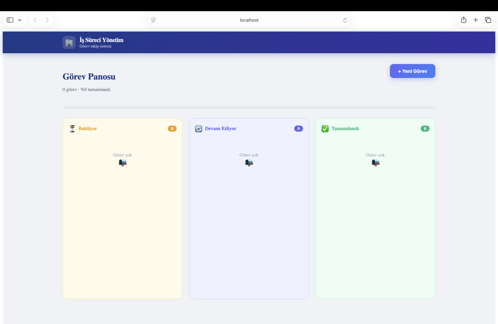
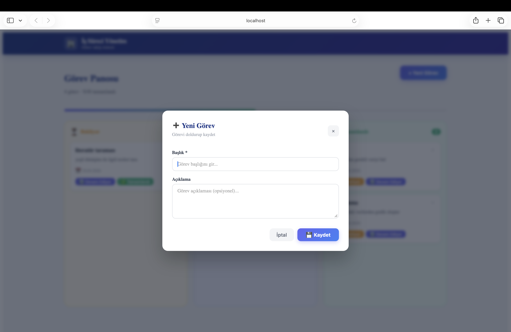
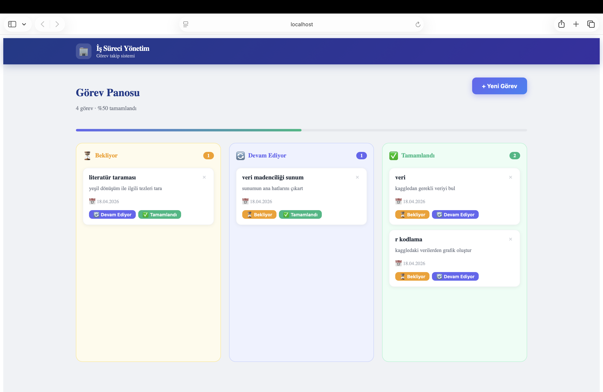

# 🏢 İş Süreci Yönetim Sistemi

Görev takibi ve iş süreci yönetimi için geliştirilmiş full-stack web uygulaması.

## 📸 Ekran Görüntüleri

### Kanban Panosu


### Yeni Görev Modal


### Dolu Pano


## 🎯 Özellikler

- ✅ Görev oluşturma, silme ve durum güncelleme
- 🔄 Sürükle bırak ile Kanban panosu
- 📊 İlerleme çubuğu
- 💬 Popup modal ile görev ekleme
- 📱 Modern ve responsive arayüz

## 🏗️ Mimari — Onion Architecture
backend/
├── IsSureci.Domain/         → Entity'ler, iş kuralları
├── IsSureci.Application/    → Servisler, DTO'lar, interface'ler
├── IsSureci.Infrastructure/ → Veritabanı, repository'ler
└── IsSureci.API/            → Controller'lar, endpoint'ler
frontend/
└── src/
├── components/          → Modal bileşenleri
├── pages/               → Sayfa bileşenleri
└── services/            → API iletişimi

## 🔧 Kullanılan Teknolojiler

**Backend:**
- .NET 10
- ASP.NET Core Web API
- Entity Framework Core
- SQLite
- Swagger / OpenAPI

**Frontend:**
- React.js
- Axios
- CSS-in-JS

## 🚀 Kurulum

### Backend
```bash
cd backend/IsSureci.API
dotnet run
```

### Frontend
```bash
cd frontend
npm install
npm start
```

## 📡 API Endpoint'leri

| Method | Endpoint | Açıklama |
|--------|----------|----------|
| GET | /api/Gorev | Tüm görevleri getir |
| GET | /api/Gorev/{id} | Tek görev getir |
| POST | /api/Gorev | Yeni görev oluştur |
| PUT | /api/Gorev/{id} | Görev güncelle |
| DELETE | /api/Gorev/{id} | Görev sil |

## 📐 Veri Modeli

```json
{
  "id": 1,
  "baslik": "Görev başlığı",
  "aciklama": "Görev açıklaması",
  "durum": 0,
  "olusturmaTarihi": "2026-04-13T13:03:58Z",
  "atananKullaniciAd": null
}
```
Durum: 0 = Bekliyor, 1 = Devam Ediyor, 2 = Tamamlandı
